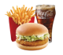

##### **Etape 1/ On récupère les données du fichier json pour les catégories :**

###### // Création de la fonction pour afficher les données dans la console :

&#x20;function getDataCat(){

###### // fonction fetch pour récupérer les données du json

&#x20; fetch("./data/categories.json")

&#x20; .then(data => data.json())

&#x20; .then(categories => {

&#x20;   console.log(categories);

&#x20; })

&#x20; }

###### // On oublie pas de lancer la fonction :

getDataCat();

##### **Etape 2/ On remplace les données en dur du html par les données réelles du fichier json :**

###### // Création de la fonction pour afficher les données dans la console puis dans le DOM:

&#x20;function getDataCat(){

###### // Pour insérer catNav dans le DOM :

const catList = document.getElementById('container-liste-categories');

###### // fonction fetch pour récupérer les données du json

&#x20; fetch("./data/categories.json")

&#x20; .then(data => data.json())

&#x20; .then(categories => {

&#x20;   console.log(categories);

###### // On créer les différentes section/div/p/img du html :

&#x20;   categories.forEach((cat) => {

###### 

&#x20;     // 

&#x20;           //   

&#x20;           //          

&#x20;           //   

&#x20;           //   

&#x20;           //          
Menus

&#x20;           //   

&#x20;     // 

&#x20;     const catNav = document.createElement('div');

&#x20;     catNav.classList.add('card-categories-nav');

&#x20;     const catNavContainerImgCard = document.createElement('div');

&#x20;     catNavContainerImgCard.classList.add('container-img-card-categorie');

&#x20;     const catNavImgCard = document.createElement('img');

&#x20;     catNavImgCard.classList.add('img-card-categorie');

&#x20;     // on récupère les données json grâce à la console (ici, on ouvre les catégories (cat) et la partie image de la categorie(image)), attention de bien mettre src pour une image :

&#x20;     catNavImgCard.src = cat.image;

&#x20;     const catNavContainerTitreImg = document.createElement('div');

&#x20;     catNavContainerTitreImg.classList.add('container-titre-img-nav');

&#x20;     const catNavTitreImg = document.createElement('p');

&#x20;     catNavTitreImg.classList.add('titre-img-nav');

&#x20;     // on récupère les données json grâce à la console (ici, on ouvre les catégories (cat) et la partie titre de la catégorie(title)) :

&#x20;     catNavTitreImg.textContent = cat.title;

###### // On implemente les div les une dans les autres selon le fichier html :

// 1/ creéation des 2 éléments (img et p) à l'interieur des div

catNavContainerImgCard.appendChild(catNavImgCard);

catNavContainerTitreImg.appendChild(catNavTitreImg);

// 2/ creation des 2 div (container) à l'interieur de la div catNav

catNav.appendChild(catNavContainerImgCard);

catNav.appendChild(catNavContainerTitreImg);

###### // On ajoute ces implémentation dans le dom :

catList.appendChild(catNav);

&#x20;   })

&#x20; })

&#x20; }

###### // On oublie pas de lancer la fonction :

getDataCat();

##### **Etape 3/ On récupère les données du fichier json pour les produits :**

function getDataProd(){

&#x20;     const prodList = document.getElementById('container-nos-menus');

&#x20;      fetch("./data/produits.json")

&#x20;     .then(data => data.json())

&#x20;     .then(produits => {

&#x20;   console.log(produits);

}

)}

##### **Etape 4/ On remplace les données en dur du html par les données réelles du fichier json :**

